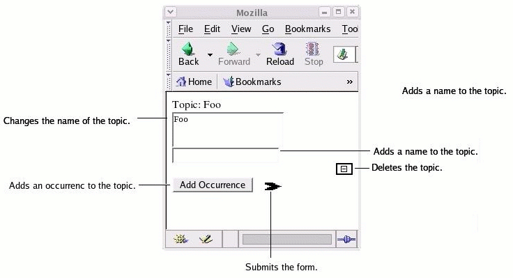

The Ontopia Web Editor Framework
================================

Configuration Guide
-------------------

<p class="introduction">
This document is a guide to configuring the Ontopia's Web Editor Framework. It describes how to use
<code>actions.xml</code> to make actions available to the JSP pages and to specify other characteristics of the
forms, such as parameters, forwarding behavior and formatting of the action
elements.
</p>

<p class="introduction">
Since the Web Editor Framework is an extension of the Navigator Framework it is assumed that you are
already familiar with the Navigator Framework. If you are not, you are recommended to start with the
Navigator Framework Developer's Guide before continuing with this document.
</p>

<p class="introduction">
This document is useful reading either before or after reading The Ontopia Web Editor Framework —
Developer's Guide, since it defines the actions, buttons and fields that are used in the Developer's
Guide. However, both documents are self-contained, and can be read
individually.
</p>

<span class="version">Ontopia 5.1 2010-06-09</p>

### Introduction ###

The actions available to Ontopia's Web Editor Framework are configured by `actions.xml`, which
should be located in the `WEB-INF/config` directory. The 'action_config' parameter in 'web.xml'
actually specifies the location; this is just the default.

The configuration is divided into five different parts. One of them - the actionGroup is the
interface from the JSP pages to the actions. There may be multiple actionGroups with different
configurations. Each `<webed:form>` tag uses one actionGroup, which specifies a set of actions and
forward rules. These actions can be used by the fields and buttens on that
form.

The other five parts, some of which are optional, all of which can be used at most once, contain
configuring information to be used by the actionGroups or formatting information for the form
elements (e.g. the size of an input field or the alignment of a button).

This document describes the different parts of the configuration with examples and shows how the
configured actions can be used from the JSP pages.

### &lt;actionConfig&gt; - the root element ###

This is the root element of actions.xml, and contains five sub-elements, which handle the different
parts of the configuration.

````dtd
  <!ELEMENT actionConfig (classMap, buttonMap?, fieldMap?,
                          globalForwards?, actionGroup+)>
````

The following sections describe the sub-elements of `<actionConfig>`.

### &lt;classMap&gt; ###

Maps shortcut names for actions to the fully qualified Java class names of the classes. The actions
can then be referred to by their shortcut names within `actions.xml`.

````dtd
    <!ELEMENT classMap (class+)>
      <!ELEMENT class EMPTY>
      <!ATTLIST class shortcut ID    #REQUIRED>
      <!ATTLIST class fullname CDATA #REQUIRED>
````

The `<classMap>` element must contain one or more `<class>` elements. Each `<class>` element maps
one shortcut name to the fully qualified Java class name of an action class.

**Example configuration**

````xml
  <classMap>
    <class shortcut="Delete"
           fullname="net.ontopia.topicmaps.webed.impl.actions.tmobject.Delete"/>
    <class shortcut="EvaluateLTM"
           fullname="net.ontopia.topicmaps.webed.impl.actions.tmobject.EvaluateLTM"/>
    <class shortcut="AddBasename"
           fullname="net.ontopia.topicmaps.webed.impl.actions.basename.AddBasename"/>
    <class shortcut="SetValue"
           fullname="net.ontopia.topicmaps.webed.impl.actions.basename.SetValue"/>
    <class shortcut="DefaultAction"
           fullname="net.ontopia.topicmaps.webed.impl.actions.DefaultAction"/>
  </classMap>
````

This example makes 5 action classes available to the action groups, which in turn can make them
available to the JSP pages and configure specific forward behavior (within each actionGroup).
Details of the `<actionGroup>` element is given below.

### &lt;buttonMap&gt; ###

Global mapping between image short names and image properties like location and size used by action
buttons.

````dtd
    <!ELEMENT buttonMap (image+)>
      <!ELEMENT image EMPTY>
      <!ATTLIST image name        ID    #REQUIRED>
      <!ATTLIST image src         CDATA #IMPLIED>
      <!ATTLIST image absolutesrc CDATA #IMPLIED>
      <!ATTLIST image width       CDATA #IMPLIED>
      <!ATTLIST image height      CDATA #IMPLIED>
      <!ATTLIST image border      CDATA #IMPLIED>
      <!ATTLIST image align       CDATA #IMPLIED>
````

The `<buttonMap>` element must contain one or more `<image>` elements. Each `<image>` element maps
an image short name to an image source and other formatting information, i.e. width, height, border
and alignment.

The attributes 'src' and 'absolutesrc' specify the source by a relative and an absolute path
respectively. To avoid confusion, only one of these should be specified. If both are specified then
the absolute path will be used.

**Example configuration**

````application/x-jsp
  <buttonMap>
    <image name="delete" border="2" align="right"
           absolutesrc="http://localhost:8080/myapp/images/delete.gif"/>
    <image name="submit" width="50" height="20"
           src="/images/submit.gif"/>
  </buttonMap>
````

This example configuration makes the images `delete.gif` and `submit.gif` accessible from the JSP
pages by the short names 'delete' and 'submit'. Both files are located in the directory `images`,
but 'delete' is specified by an absolute path and 'submit' by a relative path.

**Example JSP**

````application/x-jsp
      <webed:button action="delete" image="delete-image" params="NAME"/><br>
      <webed:button action="submit" image="submit" params="TOPIC"/><br>
````

In this example JSP, the delete button will be aligned to the right with a border of width 2. The
submit button will have width 50 and height 20. Some of the formatting may not show up in the
internet browser, depending on which browser you use. This is because different browsers interpret
the generated HTML differently, e.g. some browsers will not take width and height into account (but
use the original size of the image). The action names 'delete' and 'submit' are defined in the
`<actionGroup>` which will be described below.

### &lt;fieldMap&gt; ###

Global mapping between field type short names and field properties such as size and input type.

````dtd
    <!ELEMENT fieldMap (field+)>
      <!ELEMENT field EMPTY>
      <!ATTLIST field name      ID    #REQUIRED>
      <!ATTLIST field type      CDATA #REQUIRED>
      <!ATTLIST field maxlength CDATA #IMPLIED>
      <!ATTLIST field columns   CDATA #IMPLIED>
      <!ATTLIST field rows      CDATA #IMPLIED>
````

The `<fieldMap>` element must contain one or more `<field>` elements. Each `<field>` maps a field
type short name to a a field type and other formatting information. Note that some attributes only
apply to certain fields, e.g. a textarea can have multiple rows, but a text field can only have one
row, and so the 'rows' attribute has no effect.

**Example configuration**

````application/x-jsp
  <fieldMap>
    <field name="long"     type="textarea" columns="20" rows="2"/>
    <field name="password" type="password" maxlength="20"/>
  </fieldMap>
````

This example configuration makes the field types 'textarea and 'password' available to the JSP pages
by the short names 'long' and 'password'. Fields of type 'long' will show up as textareas of 2 rows
by 20 colums. Fields of type 'password' will show up as password fields (input typically shown as
asterisks ('*') and accept maximum 20 characters.

**Example JSP**

````application/x-jsp
  <webed:field action="set-name" type="long" params="NAME">
    <tolog:out var="NAME"/>
  </webed:field>
  
  <webed:field action="add-basename" type="password" params="TOPIC">
  </webed:field>
````

This example in the context of the configuration example above, generates two fields, one of type
long, i.e. a textarea of 2 rows by 20 columns and one of type password, i.e. a password of maximum
20 characters. The actions 'set-name' and 'add-basename' will be defined in the `<actionGroup>`
elements (details below).

### &lt;globalForwards&gt; ###

Specifies reusable forward elements that should be available to all `<actionGroup>` elements.

````dtd
    <!ELEMENT globalForwards (forward+)>
      <!ELEMENT forward (reqParam*)>
      <!ATTLIST forward name  ID                    #REQUIRED>
      <!ATTLIST forward path  CDATA                 #REQUIRED>
      <!ATTLIST forward type  (success|failure|all) 'all'>
        <!ELEMENT reqParam EMPTY>
        <!ATTLIST reqParam name  CDATA #REQUIRED>
        <!ATTLIST reqParam value CDATA #IMPLIED>
````

The `<globalForwards>` element must contain one or more `<forward>` elements. Each `<forward>`
element maps a forward short name to a forward path and (optionally) a number for request
parameters. The forward path is the path of the next request, which the browser should go to after
the action has been executed. The 'type' attribute determines whether the forward should always
happen ('all') or only in certain cases (e.g. 'success').

The `<reqParam>` sub-elements specify which request parameters should be included in the forward
request.

**Example configuration**

````application/x-jsp
  <globalForwards>
    <forward name="add-occurrence" path="occurrence.jsp"  type="success">
      <reqParam name="is-new"/>
    </forward>
  </globalForwards>
````

This example configures one different forward element of type success. If an action succeeds, it
will be forwarded to occurrence.jsp. Otherwise it will be forwarded to the path defined in the
required defaultForward element (details below). An action that uses this forward element will take
the request parameter 'is-new', which can be given on the form.

### &lt;actionGroup&gt; ###

Specifies and configures the actions that should be available within a single `<webed:form>` tag in
the JSP files. Each `<webed:form>` tag must specify the name of exactly one action group, which
names and configures the actions available within that form. There may be multiple actionGroups
specifying different configurations for different forms and each actionGroup can be used by multiple
forms.

````dtd
    <!ELEMENT actionGroup ((inputField | action)*, forward*, forwardRules)>
    <!ATTLIST actionGroup name ID #REQUIRED>
````

The sub-elements `<inputField>` and `<action>` are triggered from the input fields and actions
elements (e.g. buttons) on the JSP page. The `<forward>` elements configure forwarding only
applicable to this particular actionGroup and the `<forwardRules>` element maps the different
actions to forward elements. The `<inputField>`, `<action>` and `<forwardRules>` sub-elements will
be described in detail in the following sub-sections. The `<forward>` was described in the
`<globalForwards>` section above.

#### &lt;inputField&gt; ####

Makes an action available to the forms as an input field by mapping an external name to an internal
action shortcut name.

````dtd
      <!ELEMENT inputField EMPTY>
      <!ATTLIST inputField name  CDATA #REQUIRED>
      <!ATTLIST inputField class IDREF #REQUIRED>
````

Each `<inputField>` must specify a name and a class, i.e. the name by which the input field should
be referred to from the forms and the shortcut name of the action to be triggered. See XREF! for an
example of use.

#### &lt;action&gt; ####

Makes an action available to the forms by mapping an external name to an internal action shortcut
name (defined in `<classMap>`).

````dtd
      <!ELEMENT action EMPTY>
      <!ATTLIST action name      NMTOKEN        #REQUIRED>
      <!ATTLIST action class     IDREF          #REQUIRED>
      <!ATTLIST action exclusive (true | false) #IMPLIED>
````

Each `<action>` must specify a name and a class, i.e. the name by which the action should be
referenced from the forms and the shortcut name (as given in the `<classMap>` section) of the action
to be triggered. An action can be configured to be exclusive, in which case no other actions will be
executed along with it. Actions are inclusive (exclusive="false") by default.

**Example configuration**

````application/x-jsp
    <inputField name="set-name"       class="SetValue"/>
    <action     name="add-occurrence" class="EvaluateLTM" exclusive="true"/>
    <action     name="delete"         class="Delete"/>
    <action     name="submit"         class="DefaultAction"/>
````

This example configuration makes the Delete and DefaultAction and EvaluateLTM action classes
acessible to the form by the names 'delete', 'submit' and 'add-occurrence'. 'delete' and 'submit'
are inclusive. 'add-occurrence' is exclusive.

**Example JSP**

````application/x-jsp
      <webed:field action="set-name" type="long" params="NAME">
        <tolog:out var="NAME"/>
      </webed:field><br>
      <webed:button action="add-occurrence" text="Add Occurrence"
                    params="TOPICMAP OCCURRENCE-LTM"/>
      <webed:button action="submit" image="submit" params="TOPIC"/><br>
````

This example generates one input field ('set-name') and two submit buttons ('add-occurrence' and
'submit'). If the contents of the 'set-name' action changes and the 'submit' button is clicked, then
the 'set-name' action will also be triggered and the name change will take effect. If, on the other
hand, the 'add-occurrence' button is clicked, the 'set-name' action will not be triggered, since
'add-occurrence' is exclusive.

#### &lt;forwardRules&gt; ####

Specifies which forward elements should define the forwarding for the different actions.

````dtd
      <!ELEMENT forwardRules (forwardDefault, forwardLocked?, forwardRule*)>

        <!ELEMENT forwardDefault (reqParam*)>
        <!ATTLIST forwardDefault forward IDREF #IMPLIED>
        <!ATTLIST forwardDefault path    CDATA #IMPLIED>
        
        <!ELEMENT forwardLocked EMPTY>
        <!ATTLIST forwardLocked path  CDATA         #REQUIRED>
        
        <!ELEMENT forwardRule EMPTY>
        <!ATTLIST forwardRule action  NMTOKEN #REQUIRED>
        <!ATTLIST forwardRule forward IDREF   #REQUIRED>
````

When an action is executed, a forward element will be selected as follows: If the `<forwardRules>`
element of that actionGroup contains a `<forwardRule>` for that action, then the `<forward>` will be
selected based on that `<forwardRule>`. Otherwise, the `<forwardDefault>` default element will be
used.

Note that `<forward>` elements are of type 'all' by default (details in the `<forward>` section). If
the `<forward>` is instead of type 'success'/'failure' then it will only apply to actions that
succeed/fail. If the relevant `<forward>` element is of type 'success' and the action fails then it
will, if possible, first use a `<forward>` with the same name, but of type 'failure'. If no such
`<forward>` element exists, then the `<forwardDefault>` will be used.

The `<forwardDefault>` either specifies a forward path and a set of request parameters directly or
gives reference to a `<forward>` element that handles the forwarding.

The `<forwardLocked>` element specifies a forward path that will be used if the current page tries
to access a locked object.

Each `<forwardRule>` element maps an action to a forward element.

**Example configuration**

````application/x-jsp
    <forward name="index"    path="index.jsp"></forward>
    <forwardRules>
      <forwardDefault path="default-page.html">
      </forwardDefault>
      <forwardRule action="delete"         forward="index"/>
    </forwardRules>
````

In this example the the delete action will be forwarded to "index.jsp". All other actions will be
forwarded to "default-page.html". The complete example below will illustrate better how the
forwarding works.

### Working example ###

The sections above have described how the different parts of `actions.xml` work, and have given
fragmented examples. This section will pull the differents parts together into a complete
example.

**Example configuration**

````xml
<actionConfig>
  <!-- Make five different actions available to all the actionGroups. -->
  <classMap>
    <class shortcut="Delete"
           fullname="net.ontopia.topicmaps.webed.impl.actions.tmobject.Delete"/>
    <class shortcut="EvaluateLTM"
           fullname="net.ontopia.topicmaps.webed.impl.actions.tmobject.EvaluateLTM"/>
    <class shortcut="AddBasename"
           fullname="net.ontopia.topicmaps.webed.impl.actions.basename.AddBasename"/>
    <class shortcut="SetValue"
           fullname="net.ontopia.topicmaps.webed.impl.actions.basename.SetValue"/>
    <class shortcut="DefaultAction"
           fullname="net.ontopia.topicmaps.webed.impl.actions.DefaultAction"/>
  </classMap>
  
  <!-- Make two images available to the JSP pages. -->
  <buttonMap>
    <!-- The delete-image with a border of width 2, aligned to the 
         right and given by an abolute path. -->
    <image name="delete-image" border="2" align="right"
           absolutesrc="http://localhost:8080/myapp/images/delete.gif"/>
    <!-- The submit-image of size 20x and given by a relative path. -->
    <image name="submit-image" width="50" height="20"
           src="/images/submit.gif"/>
  </buttonMap>

  <!-- Make two field types available to the JSP pages. -->
  <fieldMap>
    <field name="long"     type="textarea" columns="20" rows="2"/>
    <field name="password" type="password" maxlength="20"/>
  </fieldMap>
  
  <!-- Make two forward elements available to all actionGroups. -->
  <globalForwards>
    <!-- Handles the forwardRule 'add-occurrence' when an action succeeds. -->
    <!-- Forwards a single request parameter. -->
    <forward name="add-occurrence" path="occurrence.jsp"  type="success">
      <reqParam name="is-new"/>
    </forward>
  </globalForwards>

  <!-- Make one actionGroup available to the <webed:form> tags. -->
  <actionGroup name="index">
    <!-- Make actions and input fields available. -->
    <!-- 'add-occurrence' should always run on its own. -->
    <action     name="add-occurrence" class="EvaluateLTM" exclusive="true"/>
    <action     name="new-topic"      class="EvaluateLTM"/>
    <action     name="delete"         class="Delete"/>
    <inputField name="set-name"       class="SetValue"/>
    <action     name="submit"         class="DefaultAction"/>
    <inputField name="add-basename"   class="AddBasename"/>
    
    <forward name="index"    path="index.jsp"></forward>
    <forwardRules>
      <!-- Where to go when no forward path is specified -->
      <forwardDefault path="default-page.html"/>
      <!-- Where to go if failing to access an object because it is locked. -->
      <forwardLocked path="forward-locked.html"/>
      
      <!-- The 'delete' and 'new-topic' actions use local forward elements. -->
      <forwardRule action="delete"         forward="index"/>
      <forwardRule action="new-topic"      forward="index"/>
      
      <!-- 'add-occurrence' uses global forward elements (success/failure). -->
      <forwardRule action="add-occurrence" forward="add-occurrence"/>
    </forwardRules>
  </actionGroup>
</actionConfig>
````

The above is a complete working example `actions.xml`. Please read the <!-- comments --> between the
lines for explanation of what the different parts do.

**Example JSP**

````application/x-jsp
<%@ include file="../fragment/common-header.jsp" %>
<tolog:context topicmap="foo.ltm">
  <tolog:set query="topicmap($TOPICMAP)?"/>
  <!-- lock="TOPICMAP" ensures that noone else will modify TOPICMAP -->
  <!-- locking lasts for 60 seconds (may become adjustable later). -->
  <!-- If someone else has already locked TOPICMAP then this page will 
  <!-- automatically redirect to forward-locked.html -->
  <!-- (as specified in actions.xml above) -->
  <webed:form actiongroup="index" lock="TOPICMAP">
    <tolog:if query="topic-name($TOPIC, $NAME) order by $TOPIC, $NAME?">
      
      Topic: <tolog:out var="TOPIC"/><br>
      
      <!-- Create field that changes the topic 'NAME'. -->
      <webed:field action="set-name" type="long" params="NAME">
        <tolog:out var="NAME"/>
      </webed:field><br>
      
      <!-- Create a field that adds a given basename to the "TOPIC". -->
      <!-- Take entry as a password (entered characters shown as asterisks. -->
      <webed:field action="add-basename" type="password" params="TOPIC">
      </webed:field><br>
      
      <!-- Create a button that deletes the topic 'NAME'. -->
      <!-- Use the image that's been configured in actions.xml. -->
      <webed:button action="delete" image="delete-image" params="NAME"/><br>
      
      <!-- Use a hidden input field to set the boolean is-new variable. -->
      <!-- Notice how 'is-new' is forwarded as a request parameter inside
           <globalForwards> in actions.xml. -->
      <input type="hidden" name="is-new" value="true"/>
      
      <!-- Make a button that creates a new topic called 'bar'. -->
      <tolog:set var="TOPIC-LTM">
        [bar]
      </tolog:set>
      <tolog:set var="TOPIC-CREATOR">
        <webed:actionid action="new-topic" params="TOPICMAP TOPIC-LTM"/>
      </tolog:set>
      
      <!-- Create a button that adds an occurrence. -->
      <tolog:set var="OCCURRENCE-LTM">
        {<tolog:id var="TOPIC"/>, foo, [[Occurrence 1]]}
      </tolog:set>
      <webed:button action="add-occurrence" text="Add Occurrence"
                    params="TOPICMAP OCCURRENCE-LTM"/>
      
      <!-- Create a button that submits the form. -->
      <!-- Note that all all the buttons on this form are submit buttons,
           but the other also perform other actions.
           This button submits the form, and no other actions. -->
      <webed:button action="submit" image="submit-image"/><br>
    </tolog:if>
  </webed:form>
</tolog:context>
````

The above is an example JSP webpage that uses the `actions.xml` example configuration above. For
explanations, please read the <!-- comments --> between the lines.

**Example internet browser output.**



This example shows the output of the last JSP example as it would be displayed in the Mozilla
internet browser. Please look at the comments in the Example JSP and Example Configuration for
implementation details.

### Complete DTD for actions.xml ###


````dtd
<!-- ~~~~~~~~~~~~~~~~~~~~~~~~~~~~~~~~~~~~~~~~~~~~~~~~~~~~~~~~~~~~~~~
     This is the DTD defining the Action Configuration
     file syntax for Ontopia's Web Editor Framework.
     ~~~~~~~~~~~~~~~~~~~~~~~~~~~~~~~~~~~~~~~~~~~~~~~~~~~~~~~~~~~~~~~ -->

<!ELEMENT actionConfig (classMap, buttonMap?, fieldMap?,
                        globalForwards?, globalProperties?, actionGroup+)>

  <!-- 
    The actionConfig tag element must have a classMap then 0/1 buttonMaps then 0/1 fieldMap then 0/1 globalForwards then 0/1 globalProperties then 1/more actionGroups.
  -->  
  
<!-- ...................................................................
     Global Mapping between class short name and fully
     qualified java class path. -->

<!ELEMENT classMap (class+)>
  
  <!ELEMENT class EMPTY>
  <!ATTLIST class shortcut ID    #REQUIRED>
  <!ATTLIST class fullname CDATA #REQUIRED>

  <!--
    The classMap element must have 1/more class-es.
    Each class has a shortname (ID) and a fullname (CDATA), each is required.
  -->
  
<!-- ...................................................................
     Global Mapping between image short name and image properties
     like location and dimension used by action buttons. -->

<!ELEMENT buttonMap (image+)>

  <!ELEMENT image EMPTY>
  <!-- name: under which the image can be retrieved -->
  <!ATTLIST image name     ID    #REQUIRED>
  <!-- src: Relative URL of the image location -->
  <!ATTLIST image src      CDATA #IMPLIED>
  <!ATTLIST image absolutesrc      CDATA #IMPLIED>
  <!-- width: image width in pixels -->
  <!ATTLIST image width    CDATA #IMPLIED>
  <!-- height: image height in pixels -->
  <!ATTLIST image height   CDATA #IMPLIED>
  <!-- border: image border in pixels (default: 0) -->
  <!ATTLIST image border   CDATA #IMPLIED>
  <!-- align: image align mode (default: 'middle') -->
  <!ATTLIST image align    CDATA #IMPLIED>

  <!--
    The buttonMap element must have 1/more image-s.
    Each image has a required ID called 'name' and implied CDATA called src, absolutesrc, width, height, border and align.
  -->

<!-- ...................................................................
     Global Mapping between field short name and field properties
     like type and dimension used by action fields. -->

<!ELEMENT fieldMap (field+)>

  <!ELEMENT field EMPTY>
  <!-- name: under which the field can be retrieved -->
  <!ATTLIST field name      ID    #REQUIRED>
  <!-- type: the type of this input field (text|textarea) -->
  <!ATTLIST field type      CDATA #REQUIRED>
  <!-- maxlength: maxium length of this field (only if rows==1) -->
  <!ATTLIST field maxlength CDATA #IMPLIED>
  <!-- columns: number of field columns -->
  <!ATTLIST field columns   CDATA #IMPLIED>
  <!-- rows: number of field rows (default: 1) -->
  <!ATTLIST field rows      CDATA #IMPLIED>

  <!--
    The fieldMap element must have 1/more fields.
    Each field has a required ID called 'name' and implied CDATA called type, maxlength, columns and rows.
  -->

<!-- ...................................................................
     Global Forward Definitions
     used for an action if not explicitly defined forward exists. -->

<!ELEMENT globalForwards (forward+)>

  <!ELEMENT forward (reqParam*)>
  <!ATTLIST forward name ID #REQUIRED>
  <!-- path: relative URI to forward to -->
  <!ATTLIST forward path CDATA #REQUIRED>
  <!-- type: Action response type this forward page belongs to -->
  <!ATTLIST forward type (success|failure|all) 'all'>
  <!-- frame: the response of the forward should appear -->
  <!ATTLIST forward frame (edit|search) #IMPLIED>
  <!-- nextAction: must be a valid action 'name' entry
       the action name pattern is used as a template which
       is processed by the specified parameter rule. -->
  <!ATTLIST forward nextAction IDREF #IMPLIED>
  <!-- paramRule: Shortcut of parameter rule class (optional). -->
  <!ATTLIST forward paramRule IDREF #IMPLIED>

  <!--
    The globalForwards element must have 1/more forwards.
    Each forward has a required ID called 'name', etc..
  -->

  
    <!ELEMENT reqParam EMPTY>
    <!ATTLIST reqParam name  CDATA #REQUIRED>
    <!-- value: if no fix value is given it will be taken from the request -->
    <!ATTLIST reqParam value CDATA #IMPLIED>

<!-- ...................................................................
     Global Property Definitions for Actions and InputFields
     that are method names and the related values. -->

<!ELEMENT globalProperties (actionType+)>

  <!ELEMENT actionType (actionProp+)>
  <!-- class: must be a valid  class 'shortcut' entry -->
  <!ATTLIST actionType class IDREF #REQUIRED>  
  
    <!ELEMENT actionProp EMPTY>
    <!-- name: correlates to java bean method-name in the specified
               class/interface -->
    <!ATTLIST actionProp name  CDATA #REQUIRED>
    <!-- value: the value with which the method will be invoked -->
    <!ATTLIST actionProp value CDATA #REQUIRED>
    
<!-- ...................................................................
     Action Group for covering the modification actions on topic map
     objects (like for example changing the topic type or removing
     a subject indicator from a topic object).

     Note that actions/inputFields will be executed in the order they
     are given in the file.  -->

<!ELEMENT actionGroup ((inputField | action)*, forward*, forwardRules)>
<!ATTLIST actionGroup name ID #REQUIRED>

  <!ELEMENT inputField EMPTY>
  <!-- name: under which this input element can be used by the tags,
             must be unique inside the same action group -->
  <!ATTLIST inputField name  CDATA #REQUIRED>
  <!-- class: must be a valid class 'shortcut' entry -->
  <!ATTLIST inputField class IDREF #REQUIRED>

  
  <!ELEMENT action EMPTY>
  <!-- name: under which this action can be triggered by forms,
             must be unique inside the same action group -->
  <!ATTLIST action name      NMTOKEN        #REQUIRED>
  <!-- class: must be a valid class 'shortcut' entry -->
  <!ATTLIST action class   IDREF #REQUIRED>
  <!-- exclusive: whether the action is exclusive or not -->
  <!ATTLIST action exclusive (true | false) #IMPLIED>
  
  
  <!ELEMENT forwardRules (forwardDefault, forwardLocked?, forwardRule*)>
  
    <!ELEMENT forwardDefault (reqParam*)>
    <!-- There are two ways of specifying the default forward
         either by referencing to an existing forward definition
         or directly by giving the path by an URI -->
    <!-- forward: must be a valid  forward 'name' entry -->
    <!ATTLIST forwardDefault forward IDREF #IMPLIED>
    <!-- path: relative URI to forward to, because this is a convenience-
         shortcut, so no differentiation between success and failure page
         can be made -->
    <!ATTLIST forwardDefault path CDATA #IMPLIED>
    
    <!ELEMENT forwardLocked EMPTY>
    <!-- path: relative URI to forward to in case a lock is encountered -->
    <!ATTLIST forwardLocked path CDATA #REQUIRED>
    <!-- frame: the response of the forward should appear -->
    <!ATTLIST forwardLocked frame (edit|search) #IMPLIED>

    <!ELEMENT forwardRule EMPTY>
    <!-- action: must be a valid action 'name' entry -->
    <!ATTLIST forwardRule action  NMTOKEN #REQUIRED>
    <!-- forward: must be a valid forward 'name' entry -->
    <!ATTLIST forwardRule forward IDREF #REQUIRED>
````


