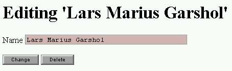

The Ontopia Web Editor Framework
================================

Developer's Guide
-----------------

<p class="introduction">
This document explains how to set up a new web editor application from scratch, and how to create
web editor applications using the Web Editor Framework. Its goal is to teach you the main concepts
in the framework so that you can develop your own applications using only the reference documents
for support.
</p>

<p class="introduction">
Since the Web Editor Framework is an extension of the Navigator Framework it is assumed that you are
already familiar with the Navigator Framework. If you are not, you are recommended to start with the
<em>Navigator Framework Developer's Guide</em> before continuing with this document.
</p>

<span class="version">Ontopia 5.1 2010-06-09</p>

### Introduction ###

The Web Editor Framework is a JSP-based framework for developing web applications where the users
can modify the contents of a topic map using a forms-based interface. This is done by writing JSP
pages which produce HTML pages containing ordinary HTML forms. These forms and the fields in them
are connected to *actions* on the server side which are triggered when the form is
submitted.

The actions triggered by a submitted form can create new constructs in the topic map, delete old
ones, modify existing ones, and generally do anything you want. The Web Editor Framework comes with
an extensive library of actions, documented in *The Web Editor Framework: Action Library Reference*.
In addition, you can easily develop your own and use them in your applications.

#### Overview of concepts ####

In order to get an overview of how the web editor framework actually works, let's walk through one
editing operation to see what happens at each stage of the process. The first step is that the user
selects a page in the web application, which is then generated in the same way that it would be with
the navigator framework. The diagram below shows how this happens.


The diagram above shows a page being generated by a JSP page on the server and loaded into the
browser, where it consists of three form fields and a button. Each of the three form fields is
connected with a topic map object on the server-side, in this case a topic name, a topic, and an
occurrence. The objects are passed as *parameters* to the actions, and the framework keeps track of
the correspondence between input field names and actions+parameters on the server
side.

The next step after this is for the user to edit the information in the form, and then press the
"Submit" button. When this happens, the form is submitted back to the `ProcessServlet` in the web
editor framework, which handles the processing of the form. This is done as shown in the diagram
below.


The ProcessServlet when receiving the form will invoke the *action group* that is connected with the
form and pass the form data as well as the parameters provided by the page to the action group. The
actions will then be invoked, modifying the topic map, and that completes the editing
operation.

There is, however, one more step, and that is to decide what page the user is going to see now. The
forwarding logic of the web editor framework is used to decide this, based on configuration provided
by the developer. (More on this later.)

### Writing an example application ###

Now that the key concepts involved in developing applications with the web editor framework have
been introduced we will move on to show how you can build such applications by developing an
example.

In order to keep the application simple we will be developing an editor for a topic map that is
essentially a project plan, consisting of tasks to be performed, and information about these. For
each task, we have a name, tasks it depends on, a person responsible for the task, a deadline date,
and a priority. The editing application will allow you to add new tasks, change existing tasks, and
so on.

#### Setting up the application ####

Before we can start building the application, however, we have to set up the environment in which it
is to run. We will walk through this step by step, and the diagram below shows a graphical view of
the structure we will create.


The first step is to create the directory shown as 'webapp' in the diagram, a directory called
`$TOMCAT_HOME/webapps/tasked`, and inside it, another called `WEB-INF`. The next step is to copy and
paste the example below into a file called `web.xml` and to put this in the `WEB-INF`
directory.

**A minimal web.xml file**

````xml
<!DOCTYPE web-app
          PUBLIC "-//Sun Microsystems, Inc.//DTD Web Application 2.3//EN"
          "http://java.sun.com/dtd/web-app_2_3.dtd">

<web-app>        

  <display-name>TaskEditor</display-name>
  <description>Simple example topic map web editor application.</description>

  <!-- General web application initialization parameters -->

  <context-param>
    <param-name>log4j_config</param-name>
    <param-value>../omnigator/WEB-INF/config/log4j.properties</param-value>
    <description>
      Tells the web editor where to find the log4j configuration file.
    </description>
  </context-param>

  <context-param>
    <param-name>app_config</param-name>
    <param-value>WEB-INF/config/application.xml</param-value>
    <description>
      Tells the web editor where to find the application configuration file.
    </description>
  </context-param>

  <context-param>
    <param-name>action_config</param-name>
    <param-value>WEB-INF/config/actions.xml</param-value>
    <description>
      Tells the web editor where to find the action configuration file.
    </description>
  </context-param>

  <context-param>
    <param-name>source_config</param-name>
    <param-value>../omnigator/WEB-INF/config/tm-sources.xml</param-value>
    <description>
      Tells the web editor where to find the topic map
      sources configuration file.
    </description>
  </context-param>

  <!-- Declare servlets -->

  <servlet>
    <servlet-name>WebEditorProcessServlet</servlet-name>
    <description>Controller Servlet getting in all requests</description>
    <servlet-class>
      net.ontopia.topicmaps.webed.servlets.ProcessServlet
    </servlet-class>
  </servlet>

  <servlet-mapping>
    <servlet-name>WebEditorProcessServlet</servlet-name>
    <url-pattern>/process</url-pattern>
  </servlet-mapping>

  
  <!-- Session parameters for this web application -->
  <session-config>
    <session-timeout>30</session-timeout><!-- in minutes -->
  </session-config>


  <welcome-file-list>
    <welcome-file>index.jsp</welcome-file>
    <welcome-file>index.html</welcome-file>
  </welcome-file-list>

</web-app>
````

The next step is to create the start page for the application. A first version of this page is given
below.

**The index.jsp page**

````application/x-jsp
<h1>The task editor</h1>

<p>Here is the task editor!</p>
````

At this point you can start the Tomcat server and connect to
[http://localhost:8080/tasked/](http://localhost:8080/tasked/) to see the start
page.

The next step is to make sure that we have the necessary configuration and are able to load the
topic map. To do this, create a directory called `WEB-INF/config`, then put the contents of the
example below into a file called `application.xml`.

**A minimal application.xml file**

````xml
<configuration type="application">
  <properties>
    <property name="defaultCharacterEncoding" value="utf-8"/>
    <property name="allowLoadOnRequest" value="true"/>
  </properties>
</configuration>
````

Once this is done, the next step is to check if the `tasks.ltm` file is present in
`${ONTOPIA_HOME}/topicmaps`, since we have told our web application to get its topic maps from there
(by using the omnigator `tm-sources.xml`). Now everything is ready, and we can start using the tag
libraries.

#### The start page ####

The first step is to update the `index.jsp` page as shown below.

**The new index.jsp page**

````application/x-jsp
<%@ page contentType="text/html; charset=utf-8" %>

<%@ taglib uri='http://psi.ontopia.net/jsp/taglib/tolog' prefix='tolog' %>

<tolog:context topicmap="tasks.ltm">

<title>The task editor</title>
<h1>The task editor</h1>

<table><tr><td valign=top>
<ul>
  <li><a href="create-task.jsp">Create new task</a>

  <tolog:foreach query="instance-of($TASK, task)?">
    <li><a href="task.jsp?id=<tolog:id var="TASK"/>"><tolog:out var="TASK"/></a>
  </tolog:foreach>

</ul>

<td valign=top>
<ul>
  <li><a href="create-person.jsp">Create new person</a>

  <tolog:foreach query="instance-of($PERSON, person)?">
    <li><a href="person.jsp?id=<tolog:id var="PERSON"/>"><tolog:out var="PERSON"/></a>
  </tolog:foreach>

</ul>
</table>

</tolog:context>
````

So far we have only created an ordinary navigator application, and the time has now come to start
making this into a web editor application. The first step would be to implement the page for editing
individual people, which is what we do in the next section.

#### The person.jsp page ####

Once this is set up we are ready to create the page for editing "person" topics. The contents of
this page are shown in the example below. (Note that it cannot be loaded before we have added one
more file.)

**The person.jsp page**

````application/x-jsp
<%@ page contentType="text/html; charset=utf-8" %>

<%@ taglib uri='http://psi.ontopia.net/jsp/taglib/tolog' prefix='tolog' %>
<%@ taglib uri='http://psi.ontopia.net/jsp/taglib/webed' prefix='webed' %>

<tolog:context topicmap="tasks.ltm">
  <tolog:set var="person" reqparam="id"/>
  <tolog:set var="name" query="topic-name(%person%, $NAME)?"/>

<title>Editing '<tolog:out var="person"/>'</title>
<h1>Editing '<tolog:out var="person"/>'</h1>

<webed:form actiongroup="person">

<p>Name 
  <webed:field action="set-name" params="name person" type="tfs">
    <tolog:if var="name"><tolog:out var="name"/></tolog:if>
  </webed:field>
</p>

<webed:button action="person"        text="Change"/>
<webed:button action="delete-person" text="Delete" params="person"/>

</webed:form>
</tolog:context>
````

The interesting parts of this page are the `webed` tags which set up the form used to change the
name of the person. The main tag is the `webed:form` tag, which creates the form in which all of the
components are placed. The `actiongroup` attribute gives the name of the action group which will
handle the form when it is submitted. This action group is declared in the `actions.xml` file, which
will be explained shortly.

The next part of interest is the `webed:field` tag, which creates a text input field. The content of
the tag produces the initial content of the field, and the value that the user writes there will be
set as the new value of the name. The `action` attribute gives the name of the action which will
handle this form field when the form is submitted (the `set-name` action is declared in the actions
file), while the `type` attribute tells the tag what template to use for this field (also declared
in the actions file).

A very important attribute is the `params` attribute which contains the names of variables that will
be passed to the action when the form is submitted. The first parameter holds the base name that is
to be modified. This is necessary in order for the action to know *which* topic name to modify. The
second parameter holds the topic that owns the topic name in case the base name has not been created
yet. The action will then create a new base name, but will need to know what topic to attach it
to.

Finally, we produce two buttons for the user to press. Each of these have actions associated with
them (given in the `action` attribute) as well as objects (in the `params` attribute) and a label
for the button (in the `text` attribute). The first button submits the changed page to the editor,
while the second button deletes the current topic. (This is why the second button needs the current
topic as a parameter: it needs to know what topic to delete.)

The result, once we add the actions file, will be the page shown in the diagram below.



The last piece necessary to make this work is the `actions.xml` file, to be added to the
`WEB-INF/config` directory as shown below.

**The actions.xml file**

````xml
<actionConfig>

  <!--~~~~~~~~~~~~~~~~~~~~~~~~~~~~~~~~~~~~~~~~~~~~~~~~~~~~~~~~~~~~~~~~
      Global mapping between class short name and fully qualified Java
      class name.
      ~~~~~~~~~~~~~~~~~~~~~~~~~~~~~~~~~~~~~~~~~~~~~~~~~~~~~~~~~~~~~~~~-->
  <classMap>
    <class shortcut="DummyAction"
           fullname="net.ontopia.topicmaps.webed.impl.actions.DummyAction"/>
    <class shortcut="ActionTopicMapCreateTopic"
           fullname="net.ontopia.topicmaps.webed.impl.actions.topicmap.CreateTopic"/>
    <class shortcut="ActionSetBasenameValue"
           fullname="net.ontopia.topicmaps.webed.impl.actions.basename.SetValue"/>
    <class shortcut="ActionDelete"
           fullname="net.ontopia.topicmaps.webed.impl.actions.tmobject.Delete"/>
    <class shortcut="ActionSetOccValue"
           fullname="net.ontopia.topicmaps.webed.impl.actions.occurrence.SetValue"/>
    <class shortcut="AssignRolePlayer"
           fullname="net.ontopia.topicmaps.webed.impl.actions.association.AssignRolePlayer"/>
  </classMap>


  <!--~~~~~~~~~~~~~~~~~~~~~~~~~~~~~~~~~~~~~~~~~~~~~~~~~~~~~~~~~~~~~~~~
       Global mapping between field short name and field properties
       like type and dimension used by action fields.
      ~~~~~~~~~~~~~~~~~~~~~~~~~~~~~~~~~~~~~~~~~~~~~~~~~~~~~~~~~~~~~~~~-->
  <fieldMap>
    <field name="tfs" type="text" columns="39" maxlength="255"/>
    <field name="tfm" type="text" columns="50" maxlength="255"/>
    <field name="tfl" type="textarea" columns="50" rows="3"/>
  </fieldMap>

  
  <!--~~~~~~~~~~~~~~~~~~~~~~~~~~~~~~~~~~~~~~~~~~~~~~~~~~~~~~~~~~~~~~~~
      Global forward definitions
      used for an action if not explicitly defined forward exists.
      ~~~~~~~~~~~~~~~~~~~~~~~~~~~~~~~~~~~~~~~~~~~~~~~~~~~~~~~~~~~~~~~~-->
  <globalForwards>
    <forward name="frontpage" path="index.jsp"/>
  </globalForwards>


  <!--~~~~~~~~~~~~~~~~~~~~~~~~~~~~~~~~~~~~~~~~~~~~~~~~~~~~~~~~~~~~~~~~
      Action group for "person" topics
      ~~~~~~~~~~~~~~~~~~~~~~~~~~~~~~~~~~~~~~~~~~~~~~~~~~~~~~~~~~~~~~~~-->
  <actionGroup name="person">
    
    <!-- actions related to form input fields -->
    <action name="set-name" class="ActionSetBasenameValue"/>
    
    <!-- principal actions -->
    <action name="person"        class="DummyAction"/>
    <action name="delete-person" class="ActionDelete" exclusive="true"/>

    <!-- Define forward rules -->
    <forwardRules>
      <forwardDefault path="person.jsp"/>
      <forwardRule action="delete-person" forward="frontpage"/>
    </forwardRules>
  </actionGroup>
  
</actionConfig>
````

The first part of the file (the `classMap`) declares shorter names for the Java classes used in the
rest of the file. After this comes a declaration of the field types referenced from the
`webed:field` tag (the `fieldMap` part).

After this follows global forwarding rules used by the `ProcessServlet` to decide where to send the
user in cases where the action group does not declare explicit rules. In this case the only
declaration we have is that the `frontpage` name is an alias for the `index.jsp` page. The idea with
this is that it makes it possible to change the front page without having to change all forwarding
rules that point to this page in the whole application.

Finally comes the declaration of the action group which corresponds to our page for editing "person"
topics. The first declares our input field and maps it to the `ActionSetBasenameValue` action. This
action takes a topic name object and sets its string value to that passed from the input field when
the form is submitted.

The next is two actions, which correspond to the two buttons we declared. The first is the
`DummyAction`, which is used for the "Submit" button, and which does nothing (the other actions take
care of everything when you press this button). The second is the `ActionDelete`, which deletes a
topic from the topic map.

Note that the `delete-person` action has been defined as *exclusive*. What this means is that if
this action is triggered only it should run, and no other actions. This ensures that we don't waste
time updating a topic that is to be deleted anyway, and also avoids problems if the `delete-person`
action is not executed last (the other actions will then attempt to update objects which are no
longer there). The last problem could be solved in this case by placing the action last in the group
(since actions are executed in the order they are given), but this is not always
possible.

Finally, we have the forwarding rules. The default is for the user to get the same `person.jsp` page
back, but if the `delete-person` action is triggered we go to the front page
instead.

And that's it. This is a complete page for editing topics of a particular type. You've now seen the
main parts of the framework, and the rest of this guide is just about how to handle more kinds of
situations.

#### Creating people and tasks ####

The next step is to make it possible to create new people. To do this we need to modify the start
page so that we can trigger action groups on the server that contain the necessary actions. This is
done by creating little forms whose buttons trigger create actions. The new start page is shown
below.

**The new index.jsp**

````application/x-jsp
<%@ page contentType="text/html; charset=utf-8" %>

<%@ taglib uri='http://psi.ontopia.net/jsp/taglib/tolog' prefix='tolog' %>
<%@ taglib uri='http://psi.ontopia.net/jsp/taglib/webed' prefix='webed' %>

<tolog:context topicmap="tasks.ltm">
  <tolog:set var="topicmap" query="topicmap($TM)?"/>
  <tolog:declare>
    using t for s"#"
  </tolog:declare>

<title>The task editor</title>
<h1>The task editor</h1>

<table><tr><td valign=top>
<ul>
  <li><webed:form actiongroup="create-task">
        <webed:button action="create-task" params="topicmap t:task"
                      text="Create task"/>
      </webed:form>
  <tolog:foreach query="instance-of($TASK, task)?">
    <li><a href="task.jsp?id=<tolog:id var="TASK"/>"
          ><tolog:out var="TASK"/></a>
  </tolog:foreach>
</ul>

<td valign=top>
<ul>
  <li><webed:form actiongroup="create-person">
        <webed:button action="create-person" params="topicmap t:person" 
                      text="Create person"/>
      </webed:form>
  <tolog:foreach query="instance-of($PERSON, person)?">
    <li><a href="person.jsp?id=<tolog:id var="PERSON"/>"
          ><tolog:out var="PERSON"/></a>
  </tolog:foreach>
</ul>
</table>

</tolog:context>
````

The only change here is that we have added buttons to create new topics, and provided them with
parameters: the containing topic map, and the type of the new topic, in that order. Note how the
second parameter has a name beginning with `t:` in both cases; this makes use of the tolog URI
prefix we declared with `tolog:declare` to refer to the topic type without having to create a
variable for it. Using this parameter we can actually create topics that are instances of "person"
and "task" as opposed to completely blank topics.

For this to work we need to add two more action groups after the first one in `actions.xml`:

**Two new action groups**

````xml
  <!--~~~~~~~~~~~~~~~~~~~~~~~~~~~~~~~~~~~~~~~~~~~~~~~~~~~~~~~~~~~~~~~~
      Action group for creating new people
      ~~~~~~~~~~~~~~~~~~~~~~~~~~~~~~~~~~~~~~~~~~~~~~~~~~~~~~~~~~~~~~~~-->
  <actionGroup name="create-person">
    <action name="create-person" class="ActionTopicMapCreateTopic"/>

    <!-- Define forward rules -->
    <forwardRules>
      <forwardDefault path="person.jsp"/>
    </forwardRules>
  </actionGroup>

  <!--~~~~~~~~~~~~~~~~~~~~~~~~~~~~~~~~~~~~~~~~~~~~~~~~~~~~~~~~~~~~~~~~
      Action group for creating new tasks
      ~~~~~~~~~~~~~~~~~~~~~~~~~~~~~~~~~~~~~~~~~~~~~~~~~~~~~~~~~~~~~~~~-->
  <actionGroup name="create-task">
    <action name="create-task" class="ActionTopicMapCreateTopic"/>

    <!-- Define forward rules -->
    <forwardRules>
      <forwardDefault path="task.jsp"/>
    </forwardRules>
  </actionGroup>
````

Notice how in both cases we forward the user onto the page for editing topics of the given type, so
that having created the topic we can edit it immediately. (The framework takes care of setting the
right request parameters to pass the object ID to the editing pages.)

#### Editing tasks ####

The next step is to start editing tasks, and this can be done quite easily by taking `person.jsp` as
the starting point. This enables us to edit the name of the task, and then we only have to add the
rest. As a first step we will add a description occurrence and an association to the person
responsible for the task. The resulting JSP is shown below.

**The task.jsp page**

````application/x-jsp
<%@ page contentType="text/html; charset=utf-8" %>

<%@ taglib uri='http://psi.ontopia.net/jsp/taglib/tolog' prefix='tolog' %>
<%@ taglib uri='http://psi.ontopia.net/jsp/taglib/webed' prefix='webed' %>

<tolog:context topicmap="tasks.ltm">
  <tolog:set var="task" reqparam="id"/>
  <tolog:declare>
    using t for s"#"
  </tolog:declare>

<title>Editing '<tolog:out var="task"/>'</title>
<h1>Editing '<tolog:out var="task"/>'</h1>

<webed:form actiongroup="task">

<tolog:set var="name" query="topic-name(%task%, $TN)?"/>
<tolog:set var="description" 
           query="occurrence(%task%, $OCC), type($OCC, description)?"/>
<tolog:set var="people" query="instance-of($PERSON, person)?"/>
<tolog:set var="person" 
           query="assigned-to(%task% : assignment, $P : responsible)?"/>
<tolog:set var="assign-assoc"
           query="select $A from
                    role-player($R, %task%),
                    association-role($A, $R),
                    type($A, assigned-to)?"/>

<table>
<tr><td>Name
    <td><webed:field action="set-name" params="name task" type="tfs">
          <tolog:if var="name"><tolog:out var="name"/></tolog:if>
        </webed:field>

<tr><td>Description
    <td><webed:field action="set-int-occurrence" type="tfs"
                     params="description task t:description">
          <tolog:if var="description"><tolog:out var="description"/></tolog:if>
        </webed:field>

<tr><td>Responsible person
    <td><webed:list action="assign-player"
          params="assign-assoc t:assigned-to task t:assignment t:responsible"
          collection="people" selected="person"/>

</table>

<webed:button action="task"        text="Change"/>
<webed:button action="delete-task" text="Delete" params="task"/>

</webed:form>
</tolog:context>
````

On this page we've added a second `webed:field` for the description occurrence. This is very similar
to that for the name, but uses a different action and also adds a parameter, so that the action can
give the occurrence its type, if it has to create it for us.

The responsible person, however, is different, since in this case we don't want a text field, but a
list of alternatives. This is done with the `webed:list` tag, which is similar to `webed:field`, but
adds some new things. Here, we no longer produce the contents of the list using `tolog:*` tags, but
instead pass it a variable containing the alternatives (this is what the `collection` attribute
does). This is used by the tag to produce a drop-down list. The optional `selected` attribute holds
the currently selected topic, if there is one.

The action used in this case will take an association as its object and assign a player to a
specific role, creating the association if it does not already exist. This is why the `params`
attribute contains so many values. The values are, in order, the association type, the role player
on this side, the role of this topic, and the role of the topic being selected. This information is
used both to select the right role to assign to and also to create new associations, if
necessary.

At this point, the only thing that remains is to update the actions file with the action group for
this page, as shown below.

**Action group for tasks**

````xml
  <!--~~~~~~~~~~~~~~~~~~~~~~~~~~~~~~~~~~~~~~~~~~~~~~~~~~~~~~~~~~~~~~~~
      Action group for "task" topics
      ~~~~~~~~~~~~~~~~~~~~~~~~~~~~~~~~~~~~~~~~~~~~~~~~~~~~~~~~~~~~~~~~-->
  <actionGroup name="task">
    
    <!-- actions related to form input fields -->
    <action name="set-name"           class="ActionSetBasenameValue"/>
    <action name="set-int-occurrence" class="ActionSetOccValue"/>
    <action name="assign-player"      class="AssignRolePlayer"/>
    
    <!-- principal actions -->
    <action name="task"        class="DummyAction"/>
    <action name="delete-task" class="ActionDelete" exclusive="true"/>

    <!-- Define forward rules -->
    <forwardRules>
      <forwardDefault path="task.jsp"/>
      <forwardRule action="delete-task" forward="frontpage"/>
    </forwardRules>
  </actionGroup>
````

At this point the application is usable, if not very useful. Most of what remains is more of the
same as what you have already seen, so the design of the application from this point on will be
aimed more at showing you new aspects of the framework than at creating something
useful.

#### Task dependencies ####

It should be possible for a task to have dependencies on other tasks, and, most importantly, on any
number of tasks. This means that we have to handle this association rather differently from the
association between the task and the responsible person. It must be possible to create new
associations as well as to delete old ones. Luckily, the `AssignRolePlayer` action is designed in
such a way as to make this quite easy.

Adding the following code to the `task.jsp` page provides support for editing dependencies:

**Editing dependencies**

````application/x-jsp
<!-- set some variables -->
<tolog:set var="tasks" query="instance-of($TASK, task), $TASK /= %task%?"/>

<%-- make empty variable --%>
<tolog:set var="empty"/>

<!-- then produce a list of drop-down lists -->
<tr><td valign=top>Depends on
    <td><tolog:foreach query="role-player($R1, %task%), type($R1, after),
                              association-role($ASSOC, $R1),
                              association-role($ASSOC, $R2), type($R2, prior),
                              role-player($R2, $OTHER)?">

          <webed:list action="assign-player"
                    params="ASSOC t:depends-on task t:after t:prior"
                    collection="tasks"
                    selected="OTHER"/> <br>
        </tolog:foreach>

        <webed:list action="assign-player"
                  params="empty t:depends-on task t:after t:prior"
                  collection="tasks"/> <br>
````

This code produces one drop-down list for each existing dependency association and afterwards adds
one more drop-down list that can be used to create a new association. All of these lists are mapped
to the `AssignRolePlayer` action. In the case of the drop-down lists for existing associations
selecting a new topic will change the association, while selecting "Unspecified" will cause the
association to be deleted. Similarly, if the user does not select a topic in the last drop-down list
no association will be created. If the user does select one, however, an association will be
created.

Note that all of this behaviour (creation, modification, and deletion of the association) is
implemented by the `AssignRolePlayer` action, and if a different action is used, the behaviour will
be different. (If you need more help on using this action, see [Using the AssignRolePlayer
action](#using-the-assignroleplayer-action).)

### Useful techniques ###

By this point we have covered the bare minimum of what is necessary to know to create a web editor
application, but there are some useful techniques that make developing with the web editor framework
easier, and we will cover them in this section.

#### Passing additional request parameters ####

In most cases the framework takes care of passing the object ID of the current object being worked
on (usually a topic) around for you, but sometimes you need to pass more parameters. When the user
submits a form it goes to the `ProcessServlet`, which processes it, and then forwards the user on to
the next page. This means that the `ProcessServlet` decides which parameters go to the next page,
and `ProcessServlet` only passes on the `id` parameter, unless told to be more
permissive.

The way to do this is to change the definition of the forward rules in the `actions.xml` file by
adding `reqParam` elements inside the `forward` or `forwardDefault` elements. The example below
shows one way of doing this:

**Using reqParam**

````xml
  <forwardRules>
    <forwardDefault path="task.jsp">
      <reqParam name="show-dependencies" value="yes"/>
    </forwardDefault>

    <!-- ... -->
  </forwardRules>
````

This will cause the default forward to go to `task.jsp?id=<objectid>&show-dependencies=yes`. If you
want the value of the extra parameter to be dynamic you can leave off the `value` attribute. In this
case the `ProcessServlet` will pass on the value it receives for this parameter, or, if it doesn't
receive the parameter at all, it will leave it out entirely.

What this means is that you must remember to pass the value of `show-dependencies` to the
`ProcessServlet`. In other words, if the user is at
`otherpage.jsp?id=<objectid>&show-dependencies=yes` and you have a forward like in the example above
the value will *not* be carried forward. The reason is that although `otherpage.jsp` got a value for
`show-dependencies` `ProcessServlet` did not, and so it could not pass it on. The solution is to add
the following to `otherpage.jsp`:

**Passing request parameters to ProcessServlet**

````application/x-jsp
  <webed:form ...>
    <!-- ... -->

    <input type=hidden name=show-dependencies
           value="<%= request.getParameter("show-dependencies") %>">

    <!-- ... -->
  </webed:form>
````

This copies the value of `show-dependencies` from the current request and passes it to
`ProcessServlet`.

#### Using LTM to create topic map content ####

Quite often one wants to do more than just create a topic of a particular type, for example one that
has a topic name in a particular scope, and an association to some other topic. There are no
ready-made tasks for this, and even if there were they would need an awful lot of parameters, and it
would be really difficult to make tasks that could cover all eventualities. Instead, we created a
task that accepts LTM fragments and reads the LTM fragment into the topic map. This allows you to
describe what you would like to have added to the topic map in an easy and flexible
way.

For example, imagine that we want to add to the `task.jsp` page the ability to create a new task
that the one being edited depends on, and to give it a name immediately, so that the user can
continue working with the current task.

To do this, all we have to do is to add a new text field for the name of the new task and attach it
to the `EvaluateLTM` task, so that if the user enters a name the task is triggered and the new task
created. To do this we add the following to the end of the table in the `task.jsp`
page:

**Adding the new field**

````application/x-jsp
<tr><td valign=top>New dependent task
    <td><webed:field action="evaluate" params="topicmap fragment"/>
````

This creates the field and sets everything up, passing the topic map and the LTM fragment to the
action, which then will read the fragment into the topic map. We haven't yet created the fragment,
however, so we have to do that. The snippet below creates the LTM fragment, and needs to be inserted
in the page somewhere above the example above, so that the `fragment` variable is defined when the
code in the example above is evaluated.

**Defining an LTM fragment**

````application/x-jsp
<tolog:set var="fragment">
  [%new% : task = "%value%"]
  depends-on(<tolog:id of="task"/> : prior, %new% : after)
</tolog:set>
````

There are several things worthy of note here, and we'll go through them one by one. First, the LTM
fragment is a string, so we use the `tolog:set` tag with content to create it. The contents of the
tag form the LTM fragment, and we can use any tags we want to produce the
fragment.

We can use topic IDs to refer to topics in the topic map. This works for topics that have source
locators of the right form. We exploit this to refer to the typing topics, but also to create a
reference to the current task, by using the `tolog:id` tag. Note that this requires the current task
to have a source locator of the right form, since LTM doesn't support any other form of topic
reference.

Finally, we see that the special syntax `%new%` and `%value%` is being used to refer to the new
topic created by this action and the string value of the form field, respectively. Note that neither
of these have to be used, and if the `%new%` token does not appear in the fragment, no new topic
will be created when the fragment is evaluated.

The last thing we need to do to make this work is to add the `evaluate` action to the `actions.xml`
file, but we leave this as an exercise for the reader.

#### Using tolog to delete topic map content ####

In some cases one wants to delete not just a single topic, association, or occurrence, but a whole
collection of objects. In this case it needs to be made clear which objects are going to be deleted,
and this is where tolog comes in. The `TologDelete` action allows you to send a tolog query to the
action, and the action will then delete all objects selected by the query.

One example in the context of the task editor might be that we want to delete all tasks which do not
depend on any other task, nor have any tasks that depend on them. To do this we can use a tolog
query that finds all these tasks and pass it to the `TologDelete` action, as shown
below.

**Using tolog for deletion**

````application/x-jsp
<tolog:set var="query">
  select $TASK from
    instance-of($TASK, task),
    not(depends-on($PRIOR : prior, $TASK : after)),
    not(depends-on($TASK : prior, $AFTER : after))?
</tolog:set>

<webed:button action="delete" params="topicmap query" text="Delete"/>
````

This is actually all it takes, except for the `actions.xml` setup, which once again is left as an
exercise for the reader.

#### Attaching JavaScript events to form controls ####

Quite often it's necessary to attach a JavaScript event to a form control in order to implement some
dynamic user interface functionality, or even to do some client-side validation of input. In HTML
every form control has a number of such events, and the JavaScript is typically attached by putting
a method call into an HTML attribute with the name of the event. However, when the control is
rendered with the tag library, that isn't possible. So how to solve it?

Instead of adding one attribute for every event to the tag library, we've chosen a simpler solution.
Every tag in the tag library that directly renders a form control, like `field`, `list`, `checkbox`,
and `button`, has an `id` attribute. This will be reproduced in the HTML output as an ID attribute
on the form control. This can then be used to attach JavaScript event handlers to the form control,
as shown below.

**Using the id attribute**

````application/x-jsp
  <webed:button action="deleteAction" text="Delete" params="topic" 
                id="delete"/>

  <script language="JavaScript">
  
    function confirmDelete() {

      return confirm("Are you certain you want to delete this topic?")

    }
  
    document.getElementById("delete").onclick = confirmDelete;
  
  </script>
````

It really is as simple as this. The only pitfall is that you must make sure that the `script`
element appears *below* the form control, so that the element has been parsed
first.

#### Rendering form controls yourself ####

In some cases it may be necessary to take control over the rendering of forms controls, for example
because you need to control in detail the rendering of a control. The tag libraries make this
possible through the `actionid` tag, which let you pass parameters to the framework and get a form
control name back.

The example below shows how this can be used.

**Rendering a list box**

````application/x-jsp
<select name="<webed:actionid action="set-role-player" 
                              params="assoc ..."/>">
   <tolog:foreach query="related-to(%topic% : start, $OTHER : end)?">
     <option value="<tolog:oid var="OTHER"/>"><tolog:out var="OTHER"
       scope="myscope"/></option>
   </tolog:foreach>
</select>
````

This simple example creates a list box where the topics in `myscope` have been used to select the
names of the topic being shown. Otherwise it is exactly like an ordinary list rendered by
`webed:list`. The magic here is performed by the `webed:actionid` tag which causes the parameters to
be bound to a form control name, which is then output. This means that when the form is submitted
the action is invoked in the usual way.

Note that there is one important difference between controls rendered this way, and controls
rendered in the usual way. The usual controls only cause actions to be invoked when the value of the
control changes, but since the framework does not know the initial value of a custom-rendered
control it is always invoked. We are considering to fix this, but haven't yet done
so.

#### Searching to find topic to associate with ####

In most cases when editing a topic there is not too many topics that it could be associated with,
but occasionally a topic could be associated with any one of thousands of other topics. In these
cases it's clearly not a good idea to create a drop-down list containing all these topics. So, what
to do?

A common solution is to use a pop-up dialog to search for the topic you want to create an
association to. You can create a text field (containing the name of the associated topic, if any)
with a button to open the search pop-up next to it. Using JavaScript this can be quite easy, once
you know the trick.

Imagine we are creating a page to edit books in a library system, and we want to make it possible to
attach a new author. The author has to be selected from thousands of person topics, which means we
need to use the search pop-up solution. The figure below shows what this might look
like.


The code to create this is shown below.

````application/x-jsp
<webed:form actiongroup="edit-book" id="edit-book">

  <%-- necessary variables already set --%>
  <tr><td>Author <td>
      <input type=text id=author-name>
      <input type=hidden name="<webed:actionid action="assignPlayer" 
         value="empty" params="empty o:author-of o:book o:work o:author"/>"
             id=author-oid>

      <input type="submit" value="Choose"
             onclick="return chooser('new-author')">
````

Now we've got the form controls we need, but we need to implement the `chooser` JavaScript function
(and we need to do it higher up in the page than the previous fragment). That could be done as
follows.

````application/x-jsp
<script language="JavaScript">
  function chooser(field) {
    var search = '';
    if (document.forms['edit-book'][field + '-name'].value) {
      // if the user has typed something in the name field, we can use
      // that for the search
      search = '&search=' + document.forms['edit-book'][field + '-name'].value;
    }

    window.open('chooser.jsp?field=' + field + search,'searchpopup','scrollbars=yes,resizable=yes,width=300, height=300, screenX=30, screenY=30, left=30, right=30');
    return false; // don't submit just because we pressed this button
  }
</script>
````

Now we've got the form controls, and they open a new window in which we get `chooser.jsp` with the
appropriate parameters. So the next thing is to write `chooser.jsp`. It should display something
like the figure below.


When the user clicks one of the radio buttons the name and ID of the chosen topic are written back
into the original form and the pop-up is closed. If the user clicks "Cancel" the form is closed, and
nothing happens. The user can also type a new search and press search if the right topic doesn't
appear in the list. The code to produce this window is shown below.

````application/x-jsp
<tolog:context topicmap="library.xtm">

<%
  String search = request.getParameter("search");
  String field = request.getParameter("field");
  String form = request.getParameter("form");
%>

<h1>Choose author</h1>

<form action="chooser.jsp" method="get">
<input type=hidden name=field value="<%= field %>">
<input type=hidden name=form value="<%= form %>">

<table>
<tr><td>Search
    <td><input type=text name="search" value="<%= search %>">

<tr><td colspan=2><input type=submit value="Search">
</form>

<%
  if (search != null) {
    String query =
      "value-like($TN, \"" + search + "\"), " +
      "topic-name($AUTHOR, $TN), " +
      "instance-of($AUTHOR, person)?";
%>

  <script><!--
    function choose(id, name) {
      window.opener.document.forms['<%= form %>']['<%= field %>-name'].value=name;
      window.opener.document.forms['<%= form %>']['<%= field %>-oid'].value=id;
      window.close();
      window.opener.document.forms['<%= form %>'].submit();
    }
  --></script>

  <logic:set name="authors">
    <tm:tolog query="<%= query %>" select="AUTHOR"/>
  </logic:set>

  <p>
  <tolog:foreach query="<%= query %>">
    <input type=radio name=whatever onclick="choose('<tolog:oid of="AUTHOR"/>', '<tolog:out var="AUTHOR"/>')"
         ><tolog:out var="AUTHOR"/><br>
  </tolog:foreach>

  <input type=button onclick="window.close()" value="Cancel">
<% } %>

</tolog:context>
````

#### Various tips ####

If you want to control the order in which actions are executed this is actually trivial: actions are
executed in the order they are found within the `actionGroup` element in the `actions.xml`
file.

### More advanced subjects ###

Now that we have walked through the basics of creating a web editor application it is time to look
at some of the more advanced aspects of building such applications.

#### Saving changes ####

When a form is submitted to the server the actions modify the underlying topic map, and once the
entire form has been processed the changes will either be committed or, if there were errors, rolled
back. This means that either all changes will be committed, or none. As the developer you do not
have to worry about this; the framework will handle all the details for you.

If the topic map is stored in the RDBMS backend the changes will then be automatically persisted in
the database, but if the in-memory implementation is used only the in-memory objects will change. In
this case it will be necessary to export the topic map to a file in order to persist the changed
topic map.

> **Note**
> We do *not* recommend using the in-memory implementation with Web Editor applications. Persisting
> changes by saving the topic map to disk at intervals will cause problems if users modify the topic
> map while a save is in progress. Similarly, the in-memory implementation does not support
> transactions, and thus editing operations that fail can leave the topic map in an inconsistent
> state.

> It is possible to use the in-memory implementation for development, piloting, and simple
> proofs-of-concept, however. If you really want to do this, despite our warnings, you can use the
> example code below.

````application/x-jsp
  <%@ page import="net.ontopia.topicmaps.core.*, net.ontopia.topicmaps.entry.*, 
                   net.ontopia.topicmaps.utils.*, 
                   net.ontopia.topicmaps.nav2.utils.*"%><% 
    // look up navigator application
    TopicMapRepositoryIF rep = ContextUtils.getRepository(pageContext.getServletContext());
  
    // retrieve topic map
    TopicMapStoreIF store = rep.createStore("mytopicmap.ltm", true);
    String filename = null;
    try {
      // work out correct path
      filename = pageContext.getServletContext().getRealPath("file.xtm");
  
      // save it to disk 
      ImportExportUtils.getWriter(filename).write(store.getTopicMap());
    } finally {
      store.close();
    }
  %>
  
  <p>
  File successfully saved to <%= filename %>.
  </p>
````

> To use this code, add it as a JSP page to your application (for example as `save.jsp`). It must be
> modified so that the topic map ID and the file name are correct for your application. The topic map
> can then be saved by accessing the JSP page. This will write an XTM file into the root directory of
> your web application. The code can be modified to write to the Omnigator topic maps directory, or
> the topic maps directory of your application, if desired.

#### Locking ####

When more than one person uses the editor application it can easily happen that two different users
access the same topic at the same time, which will cause the changes made by one user overwrite
those made by the other.

In order to avoid this the web editor framework lets you lock a collection of objects when rendering
a form. Typically, this collection will only contain the topic being modified, but there are
occasions when you may want to lock dependent objects. To do this, simply use the `lock` attribute
of the `webed:form` element, as shown below.

**Using the lock attribute**

````application/x-jsp
<webed:form actiongroup="person" lock="person">

<p>Name 
  <webed:field action="set-name" object="name" type="tfs">
    <tolog:out var="name"/>
  </webed:field></p>

<webed:button action="person"        object="person"   text="Change"/>
<webed:button action="delete-person" object="person"   text="Delete"/>
</webed:form>
````

This shows the form for editing the name of a 'person' topic modified to lock the person topic when
the page is rendered. This means that until the form is submitted nobody else can edit this topic.
The `lock` attribute must contain the name of a variable, and all the objects in the collection that
variable is bound to will be locked. Should one of them fail to be locked none will be locked, and
the page will fail to load with an error message.

You can control what page the user is to go to next should the locking fail by adding an element to
the corresponding action group. Below is shown how this is done for the form shown
above.

**Action group for 'person' topics**

````xml
  <actionGroup name="person">
    
    <!-- actions related to form input fields -->
    <action name="set-name" class="ActionSetBasenameValue"/>
    
    <!-- principal actions -->
    <action name="person"        class="DummyAction"/>
    <action name="delete-person" class="ActionDelete"/>

    <!-- Define forward rules -->
    <forwardRules>
      <forwardDefault path="person.jsp"/>
      <forwardLocked path="locked-person.jsp"/>
      <forwardRule action="delete-person" forward="frontpage"/>
    </forwardRules>
  </actionGroup>
````

If the person topic being edited is locked, this will forward the user onto the `locked-person.jsp`
page.

When a form is submitted the locks established by that form will be released, but it may well be
that the user never submits the form. In this case the lock will expire after a
timeout.

##### Clustering #####

When using the RDBMS Backend Connector in a cluster the Web Editor locks will also have to be
clustered, so that locks are being properly synchronized across the cluster. To do this one can use
a tool called [Open Terracotta](http://www.terracotta.org/). No code changes are required, but an
active Terracotta server must be running. The JVM(s) running Ontopia must also be
Terracotta-enabled.

To start the Terracotta server, first download and install the Terracotta software. Then start up
the server with the following command:

````
cd $TERRACOTTA_HOME
sh ./bin/start-tc-server.sh
````

Note that you may want to adjust the Terracotta server configuration to your needs. You may also
want to have additional passive servers running so that you get failover
support.

To make the JVM(s) running the Ontopia Terracotta-enabled a few system properties need to be passed
on to the JVM on startup:

````
-Xbootclasspath/p:${TERRACOTTA_HOME}/lib/dso-boot/dso-boot-hotspot_XX_YYY_ZZ.jar
-Dtc.install-root=${TERRACOTTA_HOME}
-Dtc.config=${ONTOPIA_HOME}/rdbms/clustering/ontopia-terracotta.xml
````

Before you start the JVM make sure that you have created a boot jar for your specific JVM. The boot
jar file can be found in `${TERRACOTTA_HOME}/lib/dso-boot/`. A new boot jar can be created with the
following command:

````
cd $TERRACOTTA_HOME
sh /bin/make-boot-jar.sh
````

You may also want to make some changes to the default Terracotta client configuraton file that is
shipped with Ontopia:
`${ONTOPIA_HOME}/rdbms/clustering/ontopia-terracotta.xml`.

#### Writing custom actions ####

If the Web Editor Framework does not contain the action you need to implement a specific piece of
functionality you can always write your own action and plug it into the system. What you do is to
create a class that implements the `net.ontopia.topicmaps.webed.core.ActionIF`
interface.

An action object must have a method implementing the action, and that's all. This method is what
actually performs the action when matching form data is received.

The action will be passed two parameters, one of which implements the `ActionParametersIF`. Through
this object the parameters passed to the action can be retrieved, as well as any string values or
objects passed by the form element. In addition there is the `ActionResponseIF`, which can be used
to set request parameters for the forward page.

The interaction with transactions means that there are some important rules that action
implementations *must* follow:

*  Never call the `commit` or `abort` methods on the transaction object from an action. This will
   interfere with the transaction handling of the framework and will have unpredictable
   consequences.
*  Do not keep *any* references to topic map objects between calls to the `perform` method. Topic map
   objects are bound to a specific transaction, and the next time the action is called the action may
   be executing in a different transaction. Trying to use objects retrieved from another transaction
   could have disastrous consequences.
*  Make sure your action object is thread-safe. That is, the `perform` method can be called by
   different threads and it may be called by one thread before having finished executing for another.
   So be very careful with storing state on the object.

If something goes wrong within the action the action should throw an exception. Errors reported by
actions generally fall into two categories:

Non-critical errors
:    These are generally errors caused by misbehaviour on the part of the user (incorrect string values,
     operation performed that was not allowed, etc), which are detected by the action, and reported back
     to the user. Non-critical errors do not prevent other actions from running, nor do they cause the
     transaction to be rolled back.

Critical errors
:    These are generally caused by bugs or environment failures (full disk, database is down, etc).
     Critical errors prevent other actions from running and cause the transaction to be rolled back so
     that the state of the topic map is not affected.


The Web Editor Framework considers only `ActionRuntimeException`s which do not have the `critical`
property set to be non-critical errors. All exceptions of other classes, as well as those which have
the `critical` property set are considered critical.

#### Using the AssignRolePlayer action ####

The first problem people tend to run into when using this action is that they can't quite work out
what the long list of parameters means, and usually this is because they don't really understand the
structure of associations. This is not so strange, since associations are actually quite
complicated. Even a binary association has eight different components, as shown in the diagram
below.


This diagram shows an association stating that one task depends on another, so this is an example of
the associations we might be editing in [Task dependencies](#task-dependencies). The list below
explains each numbered node in the diagram.

 1.  This is 'test-x', one of the tasks, which is to test software system X. So this is the topic being
    edited in [Task dependencies](#task-dependencies); the current task, if you
    like.
 2.  This is the role type 'after', which is played by the thing that depends on another. (So this
    association says that 'test-x' depends on 'implement-x'.) Note that this is a
    topic.
 3.  This is the association type 'depends-on', also a topic.
 4.  This is the role type 'prior', which is played by the thing that something depends on, and it's a
    topic, too.
 5.  This is 'implement-x', another task, which is to implement software system X. This is the topic that
    you would select in the drop-down list to create (or change) the association.
 6.  This is an association role, which has the type 'after' and is played by the 'test-x' topic.
 7.  This is the association itself, which has two roles and the type 'depends-on'.
 8.  This is the other association role, which has the type 'prior' and is played by the 'implement-x'
    topic.

Now we can walk through the list of parameters to the action and work out what each one means.

association
:    This parameter needs to contain the association itself (number 7 above). If it contains an
     association the action will change the topic at the other end of the association (that is, it will
     change number 5 to whatever topic is chosen in the list). If it is empty, the action will create a
     new association from scratch. (More on this below.)

assoctype
:    This parameter needs to contain the association type, which is number 3 in the list above.

fixedplayer
:    This is the topic being edited; number 1 in the list.

fixedrole
:    This is the type of the role played by the edited topic; number 2 in the list.

otherrole
:    This is the type of the role played by the other topic; number 4 in the list.


In the explanation above, one thing that can be a bit tricky to understand is how the `association`
parameter works. What's the difference between the parameter being empty and not being empty, and
how can you make sure the value is right? Let's return to the example in [Task
dependencies](#task-dependencies) and study it more carefully.

**Drop-downs for existing associations**

````application/x-jsp
<!-- produce a list of drop-down lists -->
<tr><td valign=top>Depends on
    <td><tolog:foreach query="select $ASSOC, $OTHER from
                                role-player($R1, %task%), type($R1, after),
                                association-role($ASSOC, $R1), type($ASSOC, depends-on),
                                association-role($ASSOC, $R2), type($R2, prior),
                                role-player($R2, $OTHER)?">

          <webed:list action="assign-player"
                    params="ASSOC t:depends-on task t:after t:prior"
                    collection="tasks"
                    selected="OTHER"/> <br>
        </tolog:foreach>
````

What we do here is to query for all `depends-on` associations and produce a drop-down list for each
one. So inside the foreach-loop `ASSOC` will always be bound to node number 7 from the diagram, `R1`
will be node 6, `R2` node 8, and `OTHER` will be node 5. The `task` variable was set outside the
loop to the current topic, which is node 1.

This means that the first parameter will always have an association in it, and so the action will
change the topic at the other end of that association to whatever is chosen in the list. (If nothing
is chosen the association is deleted.) Compare the list of parameters in the example with the list
above, and it should be clear what each one is.

Now we've seen how to edit existing associations, but not how to create new ones. Below is the
relevant part of the example from [Task dependencies](#task-dependencies).

**Creating new associations**

````application/x-jsp
<%-- make empty variable --%>
<tolog:set var="empty"/>

<webed:list action="assign-player"
          params="empty t:depends-on task t:after t:prior"
          collection="tasks"/>
````

The difference with the previous example is the first parameter, which is now set to the `empty`
variable. The `tolog:set` tag doesn't get a value from anywhere, so the variable ends up being
empty, that is, bound to nothing. If the user selects a task now, the action will see that there is
no pre-existing association, and create a new one. Since it has the association type and role types,
plus the topic on the near end, in its parameter list it has enough information to build the
association from scratch.

There is one more situation in which this action is often used, and that is when the topic being
edited only can have a single association of the edited type. Let's say that tasks can have a status
(and only one), which is indicated with an association like this (in LTM):

````tolog
has-status(implement-x : task, wait : status)
````

This means the task is waiting for tasks it depends on to be finished. The example below shows how
we would edit this type of association.

**Drop-downs for single associations**

````application/x-jsp
<tolog:set var="status-assoc"
           query="select $ASSOC from
                    role-player($R1, %task%), type($R1, task),
                    association-role($ASSOC, $R1), type($ASSOC, has-status),
                    association-role($ASSOC, $R2), type($R2, status),
                    role-player($R2, $OTHER)?"/>

<tolog:set var="status"
           query="has-status(%task% : task, $STATUS : status)?"/>

<tr><td valign=top>Status
    <td><webed:list action="assign-player"
                    params="status-assoc t:has-status task t:task t:status"
                    collection="statuses"
                    selected="status"/>
````

The two queries here find the association (node 7) and the current status (node 5) for us, if the
current task have them. If it doesn't, the `status-assoc` and `status` variables will be empty. This
means that if we have an association already the task will change it, and if we don't have an
association already, the task will modify it. (And this, of course, is why the task can both modify
and create associations, since it makes editing in this situation very much easier than if these
were different actions.)

#### Using the ProcessServlet log ####

It can be quite difficult to debug web editor applications, because you can't see what is happening
"behind the curtain" when a form is submitted and the actions are executed. The best solution to
this is to use log4j logging for your web application, and to enable logging from the
`ProcessServlet`.

To do this, add the following line to your `log4j.properties` file:

````properties
log4j.category.net.ontopia.topicmaps.webed.servlets.ProcessServlet=DEBUG
````

This will make the `ProcessServlet` write lots of information to the log every time a form is
submitted. For example, if I go to the page for the topic "Lars Marius Garshol" in the tasked
application, and change the name to "Lars M. Garshol" the log output will be as shown
below.

````
DEBUG "Param 'person6': '[Change]'" - ProcessServlet 
DEBUG "Param 'tm': '[tasks.ltm]'" - ProcessServlet 
DEBUG "Param 'set-name5': '[Lars M. Garshol]'" - ProcessServlet 
DEBUG "Param 'ag': '[person]'" - ProcessServlet 
DEBUG "Param 'requestid': '[rid4]'" - ProcessServlet 
DEBUG "Param 'id': '[larsga]'" - ProcessServlet 
DEBUG "Schema is not available, that might be ok." - ProcessServlet 
````

This first part of the log just shows all the parameters received by the servlet, which can be
useful to see exactly what is submitted with the form. The last line is just saying that no schema
has been found for the topic map; you can ignore this.

````
DEBUG "Working on person6 (<ActionInGroup person net.ontopia.topicmaps.webed.impl.actions.DefaultAction@1f5b4d1>)" - ProcessServlet 
DEBUG "data: [ActionData person with 0 param(s) and 0 sub-action(s)]" - ProcessServlet 
DEBUG "Original value was: [null]" - ProcessServlet 
DEBUG "Parameter value now: [Change]" - ProcessServlet 
DEBUG "Action will be executed" - ProcessServlet 
DEBUG "Working on set-name5 (<ActionInGroup set-name net.ontopia.topicmaps.webed.impl.actions.basename.SetValue@a030d6>)" - ProcessServlet 
DEBUG "data: [ActionData set-name with 2 param(s) and 0 sub-action(s)]" - ProcessServlet 
DEBUG "Original value was: [Lars Marius Garshol]" - ProcessServlet 
DEBUG "Parameter value now: [Lars M. Garshol]" - ProcessServlet 
DEBUG "Action will be executed" - ProcessServlet 
DEBUG "Working on delete-person7 (<ActionInGroup delete-person net.ontopia.topicmaps.webed.impl.actions.tmobject.Delete@1e4eb5b>)" - ProcessServlet 
DEBUG "data: [ActionData delete-person with 1 param(s) and 0 sub-action(s)]" - ProcessServlet 
DEBUG "Original value was: [null]" - ProcessServlet 
DEBUG "Parameter value now: [null]" - ProcessServlet
````

In this next section, the servlet is going through all the actions in this form, and checking for
each whether to run it or not. We can see that the 'person' action (attached to the "Change") button
will be run, because its value has changed. This is logical, since this is the button that was
pressed to submit the page. The 'set-name' action will also run, because the name was changed, but
the 'delete-person' action will *not* run, since the value hasn't changed.

````
DEBUG "Changes made, since net.ontopia.topicmaps.webed.impl.actions.basename.SetValue@a030d6 will run" - ProcessServlet 
DEBUG "User <unknown> entered transaction phase" - ProcessServlet 
DEBUG "Invoking action [ActionParameters: ], <ActionInGroup set-name net.ontopia.topicmaps.webed.impl.actions.basename.SetValue@a030d6>" - ProcessServlet 
DEBUG "Invoking action [ActionParameters: ], <ActionInGroup person net.ontopia.topicmaps.webed.impl.actions.DefaultAction@1f5b4d1>" - ProcessServlet 
DEBUG "No forward page found; getting default" - ProcessServlet 
DEBUG "Transaction committed" - ProcessServlet
DEBUG "User <unknown> left transaction phase" - ProcessServlet 
````

First, the servlet notes that at least one action has run, so actions that had `runIfNoChanges` set
to `false` should also run. Then we get to the transaction phase, where the servlet goes through
each action to be executed and executes it. Then it notes that no action has set the forward page,
so it picks the default. Then it commits the transaction. (In the in-memory version the commit step
doesn't do anything.)

````
DEBUG "Forward page is: [ActionForwardPage: relativeURL=person.jsp, framename=, nextActionTemplate=, paramRule=net.ontopia.topicmaps.webed.impl.basic.IdentityParamRule@d5cabc, reqParams={}]" - ProcessServlet 
DEBUG "Initial forward URL: person.jsp?&tm=tasks.ltm&ag=person&id=larsga" - ProcessServlet 
DEBUG "Applying param rule: net.ontopia.topicmaps.webed.impl.basic.IdentityParamRule@d5cabc" - ProcessServlet 
DEBUG "URL after rules applied: person.jsp?&tm=tasks.ltm&ag=person&id=larsga" - ProcessServlet 
INFO  "forward to person.jsp?&tm=tasks.ltm&ag=person&id=larsga" - ProcessServlet 
````

Finally, the servlet works out where to forward to. It's picked the default rule for this action
group, and that gives it the URL shown. No interesting param rules are attached, so that becomes the
final URL.


